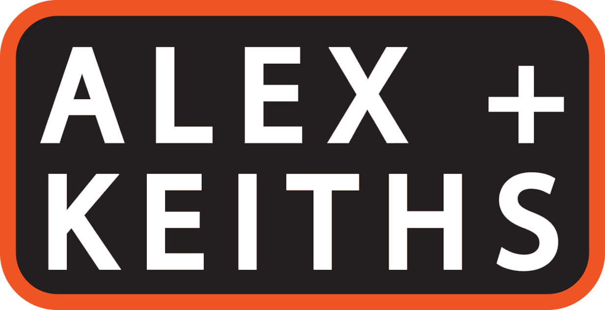

# ALEX + KEITHS (FIP)

### Description
  The concept of this website was to mix and mash two vastly different company identities (Alexander Keith's and BLACK+DECKER) into a single beer company while maintaining both signature design styles. The files included here are required view the final responsive 5-page result. Any files in the "inludes" folder are there for documenting the steps and concepts in our construction of the site.

### Prerequisites
- Unzipping software.
- Browser capable of running HTML5, CSS and Javascript code simulaneously.
- Internet connection (for social media links and embedded YouTube promo video).

### Authors
- John Wood
- Liam Yancy

### License
  This project is licensed under the MIT license. (Fanshawe College)
